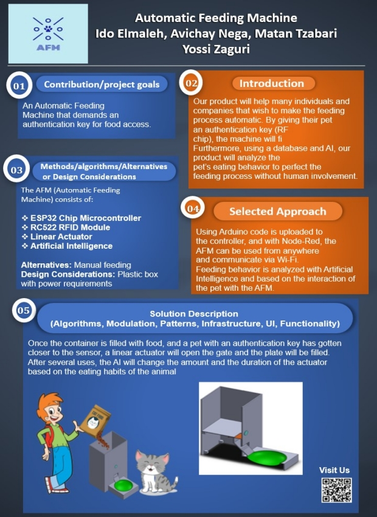

  

# 
 Final Project - Automatic feeding machine
  

Authors : Avichay nega  , [Ido Elmaliach](https://github.com/IdosElmo), [Matan Tzabari](https://github.com/matanya679)

Advisor : Yossi Zaguri  

### Project Poster
##

### Introduction
##
Artificial Intelligence that can learn the cat's behavior by analyzing it's eating patterns.  
The Automatic Feeding Machine will document eating times , amount of food per use and usage frequency.  
In addition to the analysis process, the AI can identify anomalies in the cat's behavior and report to the user.  

### appendix
##
* [Vision Statement](https://github.com/avichaynega/Final-Project/blob/master/Vision%20Statement.pdf)

* [Product Requirement Document](https://github.com/avichaynega/Final-Project/blob/master/PRD%20(product%20requirement%20document).pdf)

* [Software Design Document](https://github.com/avichaynega/Final-Project/blob/master/software%20design%20document.pdf)
