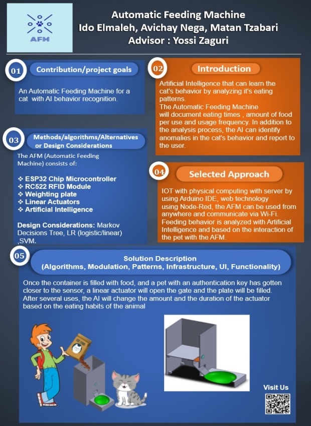

  

# 
 Final Project - Automatic feeding machine
  

Authors : Avichay nega  , [Ido Elmaliach](https://github.com/IdosElmo), [Matan Tzabari](https://github.com/matanya679)

Mail: afmproject2021@gmail.com

Advisor : Yossi Zaguri  

### Project Poster
##

### Introduction
##
Artificial Intelligence that can learn the cat's behavior by analyzing it's eating patterns.  
The Automatic Feeding Machine will document eating times , amount of food per use and usage frequency.  
In addition to the analysis process, the AI can identify anomalies in the cat's behavior and report to the user.  

### Appendix
##
* [Vision Statement](https://github.com/avichaynega/Final-Project/blob/master/Vision%20Statement.pdf)

* [Product Requirement Document](https://github.com/avichaynega/Final-Project/blob/master/PRD%20(product%20requirement%20document).pdf)

* [Software Design Document](https://github.com/avichaynega/Final-Project/blob/master/software%20design%20document.pdf)

### Prerequisite
##

For Arudino IDE
- MFRC522 by https://github.com/miguelbalboa/rfid
- HX711 Library by https://github.com/bogde/HX711
- PubSubClient

For Python AI
- Numpy
- Pandas
- Scikit-learn

MQTT Broker
- DIoTY http://mqtt.dioty.co/

### Getting started 
##    
   
  
###    MQTT: The Standard for IoT Messaging
MQTT is an OASIS standard messaging protocol for the Internet of Things (IoT). It is designed as an extremely lightweight publish/subscribe messaging transport that is ideal for connecting remote devices with a small code footprint and minimal network bandwidth. MQTT today is used in a wide variety of industries, such as automotive, manufacturing, telecommunications, oil and gas, etc.  
you can see more here https://mqtt.org/getting-started/
    
###  Arduino IDE  
  The open-source Arduino Software (IDE) makes it easy to write   
  code and upload it to the board. This software can be used with any Arduino board.  
  you can see more here https://www.arduino.cc/en/Guide/

### Node-RED  
Node-RED is a programming tool for wiring together hardware devices, APIs and online services in new and interesting ways.
It provides a browser-based editor that makes it easy to wire together flows using the wide range of nodes in the palette   
that can be deployed to its runtime in a single-click.  
you can see more here https://nodered.org/#get-started 

### ESP32 Wiring
##

The ESP32 Controller is connected to several key components:
- RF522 Sensor (Authentication sensor)
- HX711 module (Weight sensor)
- Linear Actuator (Engine)
- 2 Relays

The Actuator (our engine) is connected to the controller via 2 relays. The relays are used to reverse the polarity so the actuator can work in both directions
without having to manually reverse the wires.
Inside the Relay, pins 3-4 have an open connection, 3-2 has a closed connection, 7-8 have an open connection and 8-9 has a closed connection.
Engine batteries produce 6v.

The ESP32 has 3.3v pin and a 5v pin, the rest of the GPIO's can output 3.3v each. In order to make sure our relay works, as it should recieve 5v to activate, we did a simple trick to make sure the GPIO signal from the controller can produce 5v.

The AFM:
Once connected to power, AFM will automatically connect to your Wi-Fi. The main indicator blue light will blink showing the device is ready to be used.
Upon ID identification, the linear actuator will push the food down the canal.
Using the weight sensor, the AFM makes sure no refill will occour while there is still food on the plate.
With MQTT protocol and our mqtt broker, messages are sent to our node-red application and is saved as a csv file on a daily basis.

Node-Red + UI:

### Machine Learning

-   https://github.com/avichaynega/Final-Project/blob/master/knn_anomaly.ipynb  
   we used two models in order to show the anomality ,in first case we have used the knn model that showed the  seperation between the anomality ,
   and the normal results. for comparing with some other models we used in the second case   the Isolation Forest model we did the same process as the first model 
   and we got resembling results as shown in the graph.
   

### Future Work
##

- connect to a chosen network using Ubidots: https://ubidots.com/blog/connect-your-esp8266-to-any-available-wi-fi-network/

